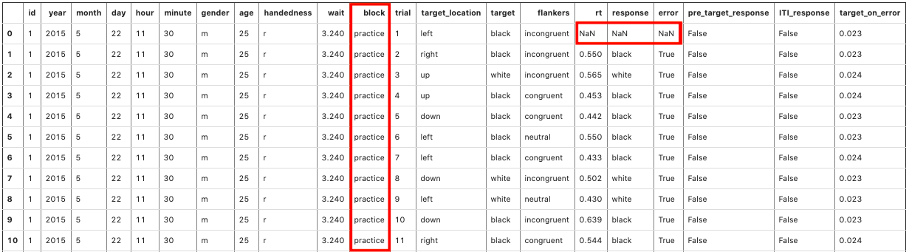
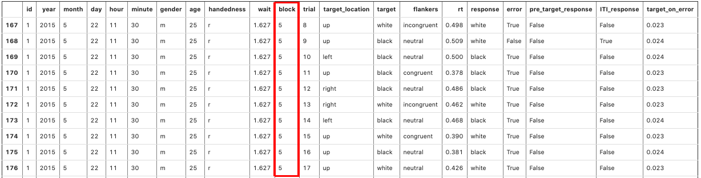

## Cleaning the Data
#### Here, I will show the code I used to clean a raw-data file so I could perform further analysis on it later on.

##### I started by reading a data file of a given study subject into a pandas DataFrame called df by using the following code: df = pd.read_csv(in_file, sep='\t'. I then observed the data in the first and last couple of rows and noticed some issues (highlighted in red). 








#### Removing Missing Data
##### I started by removing the missing data in the "rt", "response", and "error" columns. Here, the missing data was trials in which the participants didn't make a button press response. This data is represented with "NaN", which stands for "not a number", and is a value that is undefined or unpresentable. Below is the code I use to remove all rows with missing data.  


```python
df = df.dropna()
```

#### Removing Practice Trials
##### In the "block" column, I observed that the first couple of trials were practice blocks. Practice trials allow participants to understand the procedure of the experiment by making mistakes and asking questions. Since the data from practice blocks should not count towards the analysis, I removed all the rows from the practice block by using the code below. I kept all the values that didn't have 'practice' in the block column. 


```python
df = df[df.block != 'practice']

```


```python
#### Converting
##### Finally, I converted the rt column from seconds to milliseconds by using the following code: 
df["rt"] = df["rt"] * 1000
```
