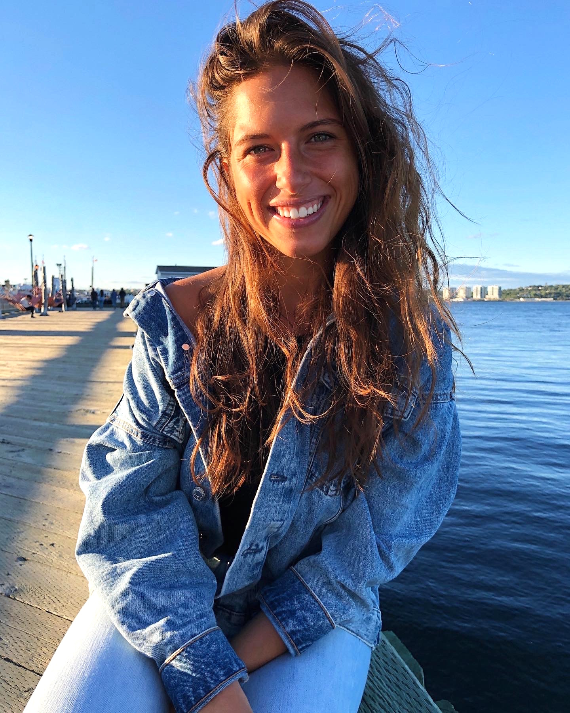

<h1>Welcome! </h1>

**Pronouns:** "she" / "her"

**Languages:** English, Hebrew
  

After graduating from <a href="https://www.dal.ca">Dalhousie University</a> with a Bachelors of Science degree in Neuroscience, I moved to South Korea to teach English. After teaching for two years, I decided to come back to school to upgrade my degree to honours.

This year (Fall 2020), I enrolled in a Neural Data Science course to challenge myself to learn a new language: **Coding**. This portfolio will showcase my acquired skills and different samples of work I've completed in the course. 
 
### Creating a DataFrame from a Dictionary
Here is an example of a code I wrote to [create a DataFrame](Provinces1.md) from a dictionary I made using different online resources.

### Visualizing a DataFrame
Here is an example of a code I wrote to [visualize the data](covidinprov1.md) from the above [example](Provinces1.md).

### Cleaning Raw Data
Here is an example of a code I wrote to [clean a raw data file](cleaningdata.md). This is important to do prior to performing Exploratory Data Analysis. 
 
### Certifications
[DataCamp: Introduction to Python](intro.pdf)
[DataCamp: Intermediate Python](inter.pdf)
[DataCamp: pandas Foundations](pandas.pdf)
[DataCamp: Manipulating DataFrames with pandas](manipulating.pdf)
[DataCamp: Merging DataFrames with pandas](intro.pdf)
[DataCamp: Intro to Data Visualization in Python](visualization.pdf)
[DataCamp: Introduction to Git](introgit.pdf)
[DataCamp: Introduction to Shell](introshell.pdf)
[DataCamp: Biomedical Image Analysis in Python](bia.pdf)

### 📫 Contact Information
Feel free to me at:
[nz323351@dal.ca](mailto:nz323351@dal.ca)

