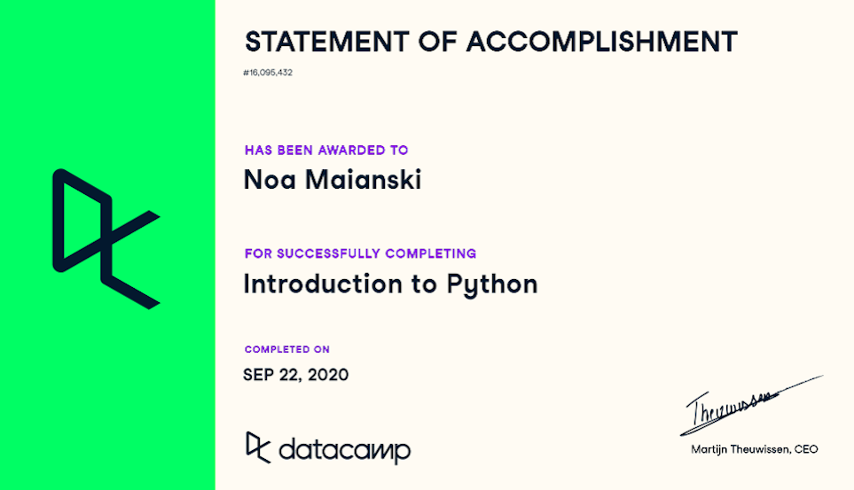
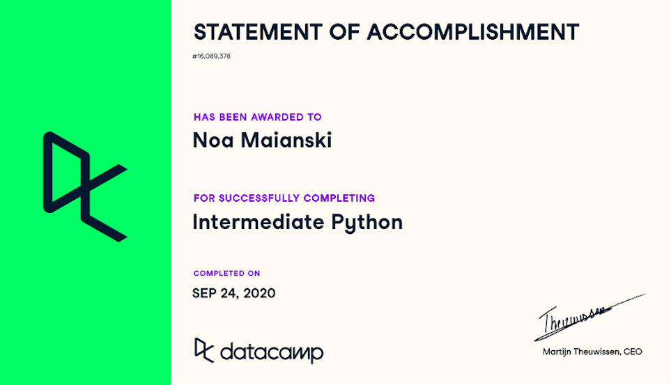
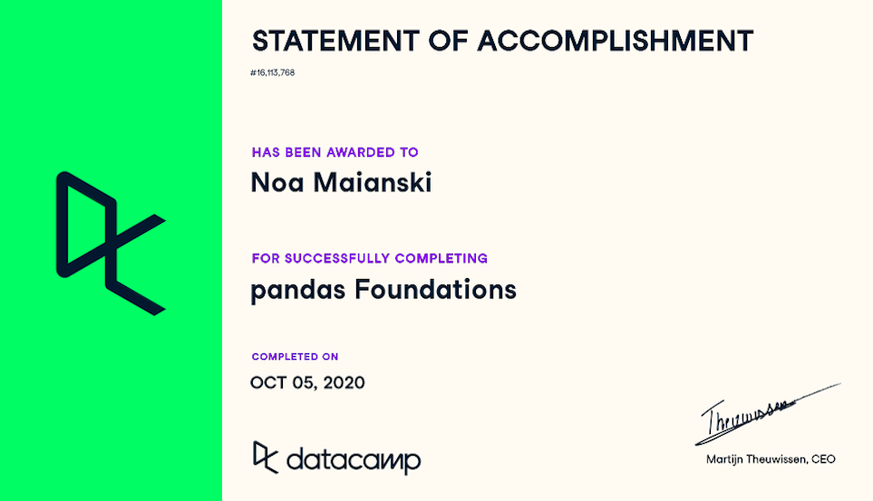
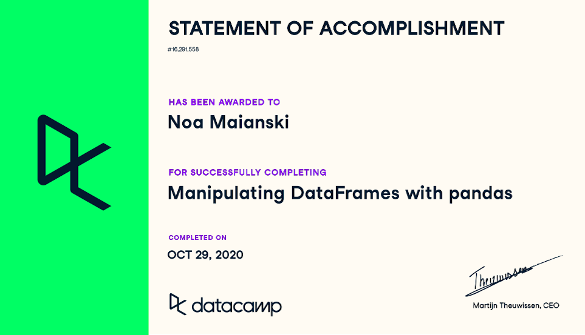
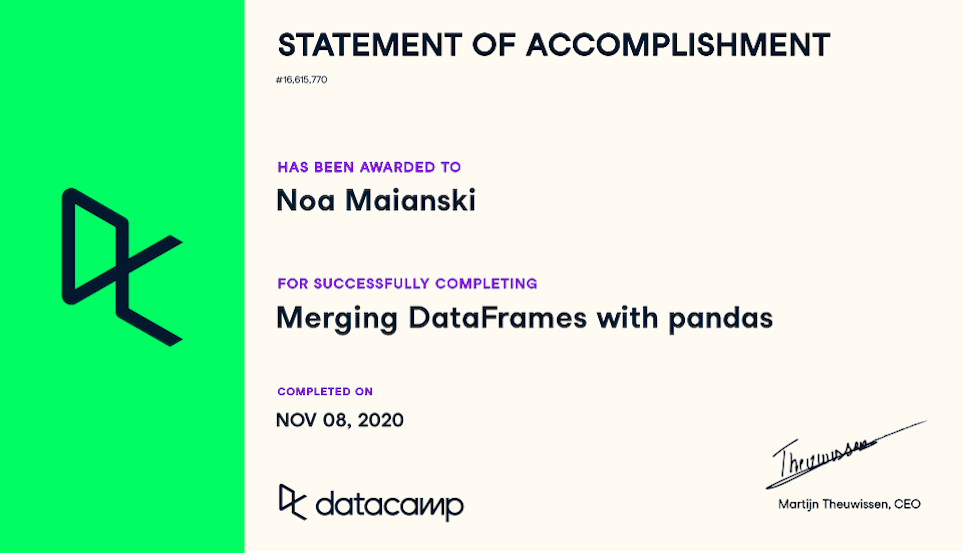
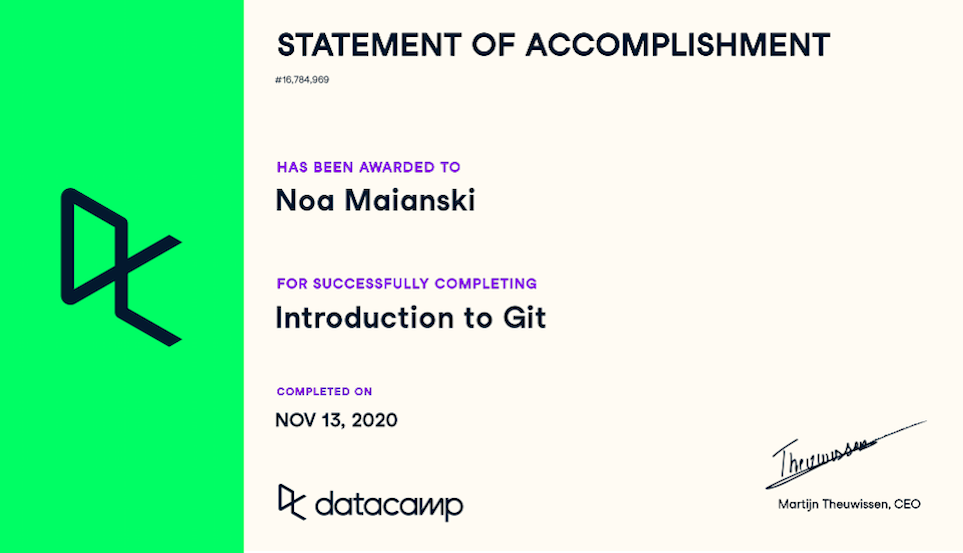
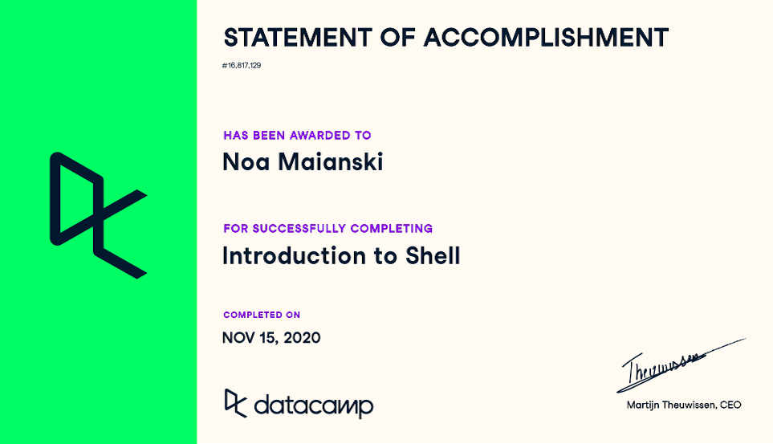
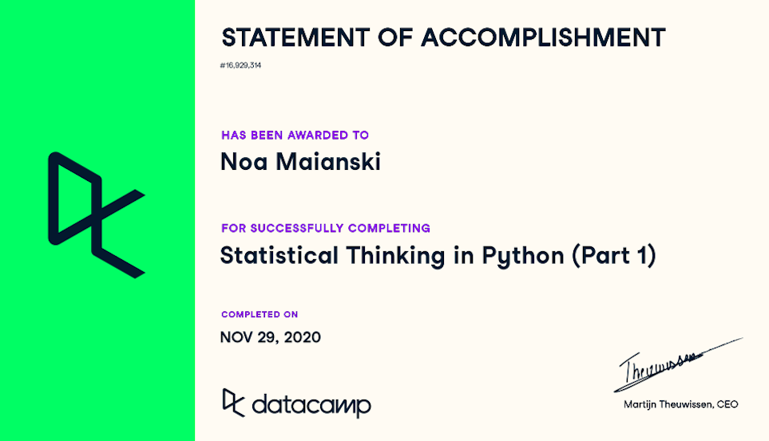
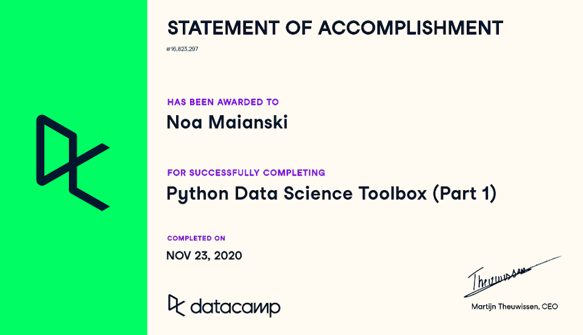

## Statements of Accomplishment
I received the following certificates upon completing coding lessons on [DataCamp](https://learn.datacamp.com). They are listed by date of completion. Together, these lessons account for more than 40 hours of coding practice! 

|  |

|  |

|  |

|  |

|  |

|  |

|  |

|  |

|  |

|  |

|  |

[Click here] to return to main page(https://noamaianski.github.io/portfolio/)
