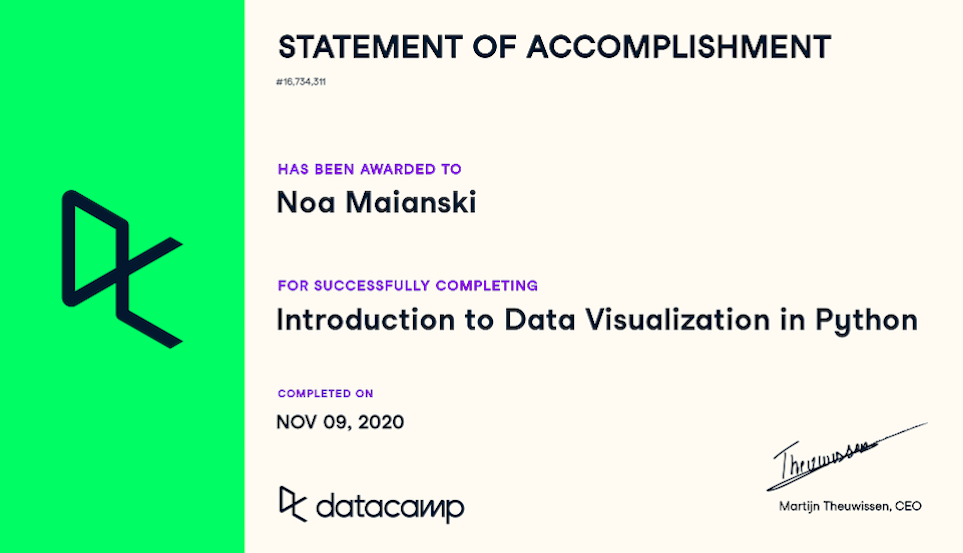

## Statements of Accomplishment
I received the following certificates after completing various coding lessons on DataCamp. They are ordered by date of completion. 

|  |

|  |

|  |

|  |

|  |

|  |

|  |

|  |

|  |

|  |

|  |
