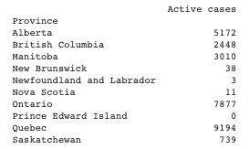

## Visualizing the DataFrame 
#### I wanted to visualize the data from a Dataframe I created using a dictionary I built. I created a new table (see below).

#### Using the code below, I visualized the amount of active COVID-19 cases in each province. 

#### As you can see, Quebec and Ontario have the highest amount of active COVID-19 cases and the Maritime provinces have the least amount of cases as of October 31, 2020. 
